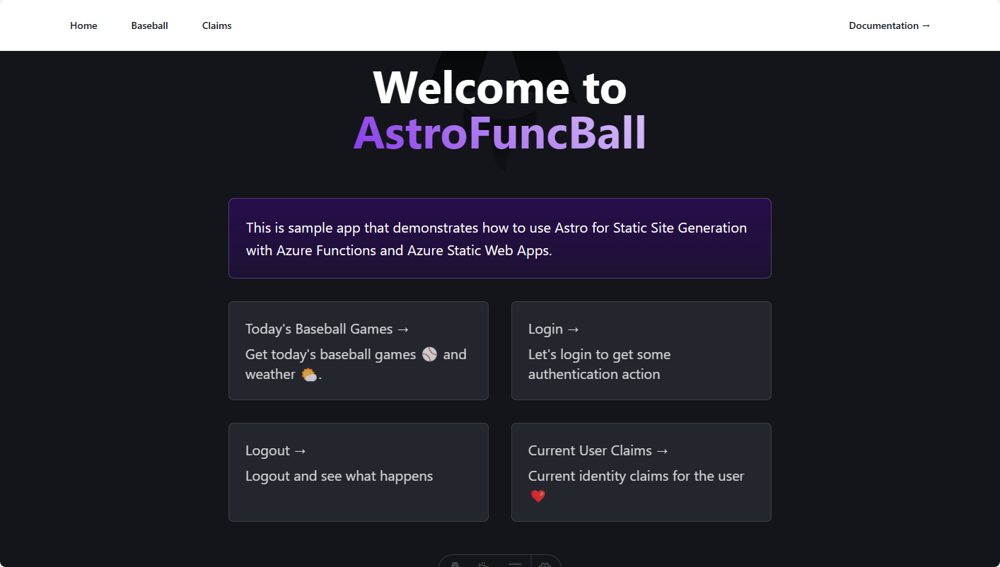

# Using Azure Functions with Astro and Entra ID Authentication

This sample project is the output of a blog which explains how to use Azure Functions with Entra ID and Astro as the static site generator.

For details on how to build, test, and deploy, please reference the following blog post.

[Using Azure Functions with Astro and Entra ID Authentication](https://agramont.net/blog/astro-entra-auth-azure-functions)

What this blog covers:
1. Astro - Static Site Generator
2. Azure Functions
3. Entra ID built-in Authentication
   1. Protected folder
   2. Protected Function (/api)
4. Create Azure Static Web App via Az CLI
5. Deploy Azure Static Web App via SWA CLI

# Acknowledgements & Terms

- [MLB API Documentation](https://appac.github.io/mlb-data-api-docs/)
- [NWS API Documentation](https://www.weather.gov/documentation/services-web-api)
- [MLB Terms and Copyright](http://gdx.mlb.com/components/copyright.txt)